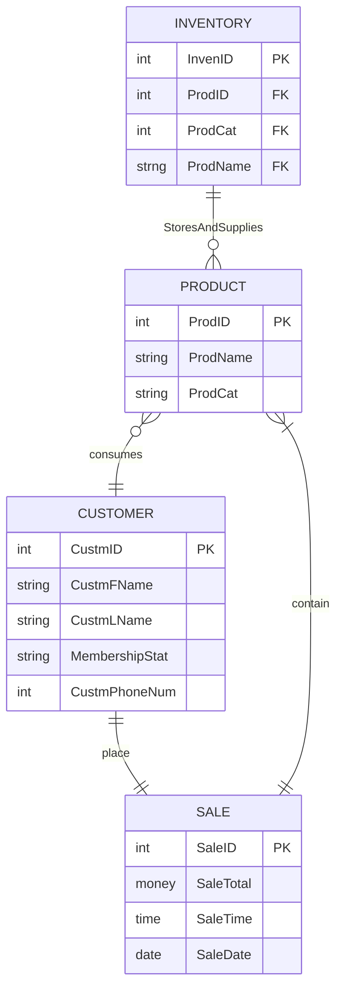

# ChickFilA ERD Graph

This actually has little to nothing to do with Chickfila and is more general

## Documentation:

#### The inventory entity represents inventory in a buesniss
- The inventory is what store and suplies the products
- Inventory can store/supplie all/none products

#### The product entity represents products in a buesniss
- Products are consumed by a Custumor
- Only one customer can consume products 
- Products are apart of a Sale
- Products can only be apart of one sale at a time

#### The customer entity reps customer in a buisness
- The costumer is who buys/consumes products
- Consumers can buy/consume many/none products
- Consumers can only make one sale at a time

#### The sale entity reps sales in a buisness
- A sale can only have one customer at a time
- A sale can contain many/one products

