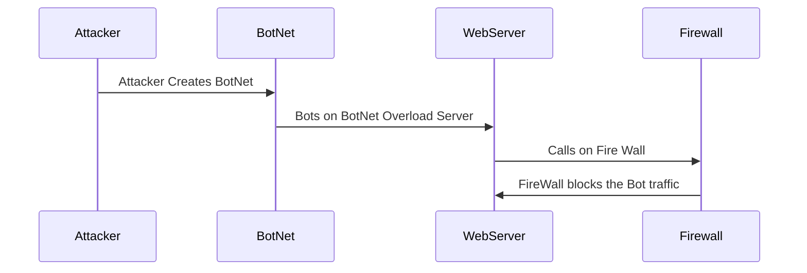

# DDoS Attack Sequence

#### 1. The attacker creates a BotNet by infecting devices with a malware that allows it to be controlled remotley\

#### 2. The BotNet target a server and spam it with IP requests, Overloading it and preventing normal traffic from going thru

#### 3. Protection services may automatically detect a DDoS attack
- Many Requests being spammed by one source
- Strange Traffic Pattern
- Multiple users with one behavior

#### 4. The Firewall blocks/drops connections from the bots

Sources:

https://www.fortinet.com/content/dam/fortinet/assets/white-papers/DDoS-Attack-Mitigation-Demystified.pdf
https://www.cloudflare.com/learning/ddos/what-is-a-ddos-attack/